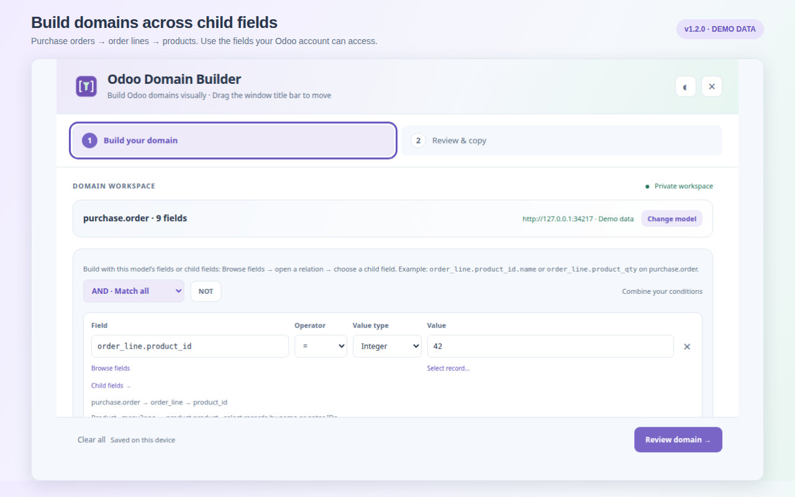
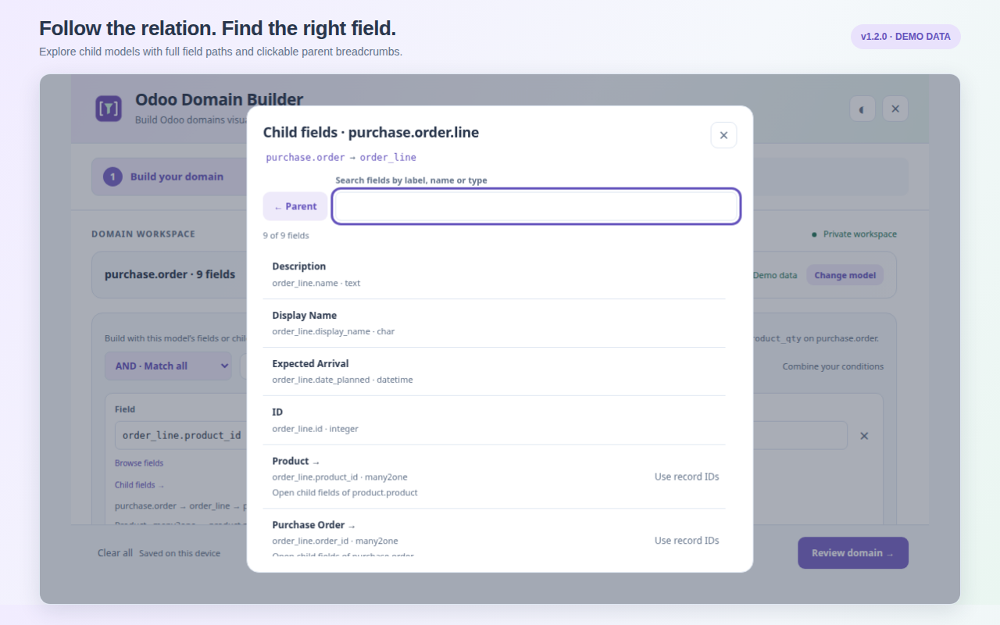
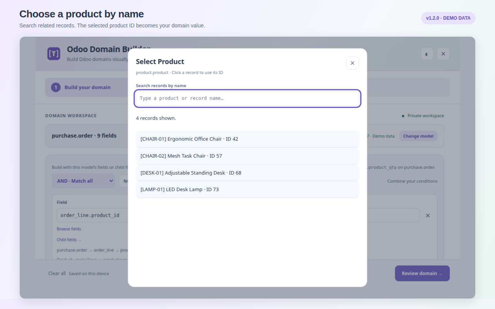
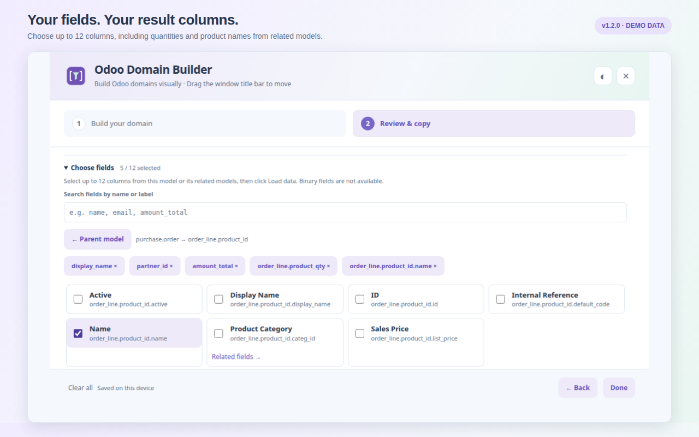
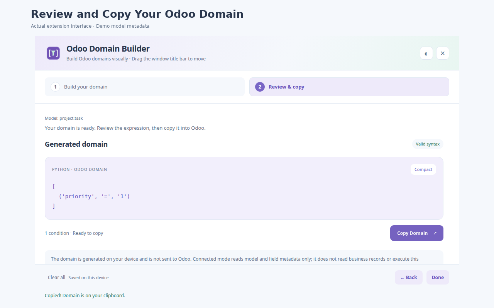

# Odoo Domain Builder — Documentation

> Version 1.1.0 · Free Chrome extension · Manifest V3 · Chrome 116 or newer
> Markdown source. The rendered, SEO-ready version is `index.html`.

Odoo Domain Builder is a free Chrome extension that lets you visually build, validate, and copy
Odoo domain expressions. Choose models and fields from your logged-in Odoo session — including
custom models, custom fields, and related fields — combine conditions with AND / OR / NOT, and
copy clean Python domain syntax with one click.



## Table of contents

- [Overview](#overview)
- [Key features](#key-features)
- [Screenshots](#screenshots)
- [How it works](#how-it-works)
- [Operators and value types](#operators-and-value-types)
- [Security, permissions, and privacy](#security-permissions-and-privacy)
- [Release notes](#release-notes)
- [FAQ](#faq)

## Overview

Odoo filters — the values of `domain` attributes on actions, views, and server code — are plain
Python-ish lists such as `[('state', '=', 'draft')]`. Learning the exact technical field names and
operators for every model is tedious and error prone.

The extension connects to your logged-in Odoo session and loads the real field metadata your
account can see. You pick a model, browse fields (searchable, along dotted relation paths), set
operators and values with type-aware inputs, and get a ready-to-paste expression.

The domain is generated entirely on your device. Click **Load data** on Review & Copy to send the domain to your selected Odoo server and preview matching records. Records are never changed.

Examples:

```python
[('state', '=', 'draft')]
[('amount_total', '>', 100.0)]
[('partner_id.country_id.code', '=', 'BD')]
[('state', 'in', ['draft', 'sent'])]
[('parent_id', 'child_of', 3)]
```

Ideal for Odoo developers, technical consultants, functional consultants, and implementers who
work with Odoo filters and domain syntax every day.

## Key features

- **Model search** — search models by label or technical name through `ir.model`, including custom
  models, with paginated results and live server search.
- **Real field metadata** — load every field `fields_get` exposes to your account, including custom
  and inherited fields. Non-searchable fields are clearly marked.
- **Related-field browser** — drill into many2one, one2many, and many2many relations up to eight
  levels and build dotted paths such as `partner_id.country_id.code`.
- **Type-aware inputs** — selection dropdowns plus validated boolean, integer, float/monetary,
  date, and UTC datetime inputs. Related fields use record IDs or JSON lists.
- **17 domain operators** — comparisons, membership (`in` / `not in`), text matching (`ilike`,
  `=like`, …), and hierarchy operators (`child_of`, `parent_of`).
- **Logical groups and validation** — AND / OR / NOT, up to five nested group levels and 100
  conditions, with inline error reporting.
- **Review, format and copy** — preview the generated domain, switch between compact and formatted
  output, copy to clipboard in one click.
- **Local drafts and themes** — drafts, model context, and light/dark theme preference are saved in
  local extension storage and restored on reopen.
- **Offline manual mode** — no Odoo connection needed; full syntax and logical-structure validation.

## Screenshots

Screenshots show the actual extension using controlled demo metadata.


*Combine conditions with AND, OR and NOT.*


*Search fields and explore related models.*


*Use custom fields and selection values.*


*Review and copy your Odoo domain.*

## How it works

1. **Install.** Open [Odoo Domain Builder on the Chrome Web Store](https://chromewebstore.google.com/detail/homeljjcgdefldcneinofjnbdagdhbmg?utm_source=item-share-cb)
   and click **Add to Chrome**. Chrome 116 or newer is required.
2. **Log in and click.** Open your Odoo backend in a regular tab and log in normally. Click the
   extension toolbar icon while that Odoo tab is active to grant temporary access.
3. **Choose a model.** Search by label or technical name (for example `sale.order`,
   `res.partner`, `project.task`, or a custom model). Select a suggestion or type a technical name
   and click **Load fields**.
4. **Build conditions.** Click **Browse fields**, search all fields returned by Odoo, or choose
   **Related fields →** to navigate a relation. Select a field, operator, and value.
5. **Combine and review.** Add conditions or nested AND / OR / NOT groups, then choose
   **Review domain →** to validate everything and view the generated expression.
6. **Copy or load data.** Click **Copy Domain** to copy the expression, or **Load data** to list matching records below it. Use **Choose fields** to search and select up to 12 columns before loading data. Binary fields are excluded. Changing the selection clears the previous results. **Load more** fetches the next 50 records. Previews require a connected model and follow your Odoo access rights.

Reconnect anytime: clicking the toolbar icon reuses the existing wizard; clicking from a different
Odoo tab switches its connection and refreshes metadata.

## Operators and value types

### Supported operators (17)

| Operator | Meaning | Value type |
| --- | --- | --- |
| `=`, `!=` | Equal / not equal | String, Boolean, Integer, Float, Date, Date/time |
| `>`, `<`, `>=`, `<=` | Numeric / date comparisons | Integer, Float, Date, Date/time |
| `in`, `not in` | Membership in a list | List (JSON) |
| `ilike`, `not ilike`, `like`, `not like`, `=like`, `=ilike` | Text matching | String |
| `child_of`, `parent_of` | Record hierarchy traversal | Integer (ID) or List of IDs |
| `=?` | Unset-aware equality | Any |

### Value types (9)

| Value type | Example input | Generated output |
| --- | --- | --- |
| String | `draft` | `'draft'` |
| Boolean | True / False | `True` / `False` |
| Integer | `10` | `10` |
| Float | `10.5` | `10.5` |
| False / unset | — | `False` |
| List (JSON) | `["draft", "sent"]` | `['draft', 'sent']` |
| Date | `2026-09-17` | `'2026-09-17'` |
| Date/time (UTC) | `2026-09-17T09:30` | `'2026-09-17 09:30:00'` |
| Empty string | — | `''` |

### Limits

- Up to 100 conditions and five nested logical group levels.
- Up to eight related-field levels in dotted paths.
- Datetimes are entered in **UTC**.
- Related fields use record IDs or JSON lists of IDs (record names are not fetched).
- Domains are sent to Odoo only for requested record previews; arbitrary Python / context expressions and server operators
  are out of scope.

## Security, permissions, and privacy

### Permissions

- **activeTab** — temporary access to the tab where you click the extension icon, used to read
  metadata from your selected Odoo session.
- **scripting** — runs a packaged, self-contained function in that tab's isolated world for session
  checks and metadata loading.

No host permissions, cookies, tabs, browsing-history, webRequest, or storage permissions are
requested. No remote code and no auto-injected content script.

### Privacy

- No credentials: you are never asked for a password or API key; the existing session is reused.
- Selected server only: metadata and record-preview requests go only to your selected Odoo origin and follow its normal access
  controls.
- Record previews: Load data sends the domain and values only to your selected Odoo server. Loaded records remain in memory and are never changed.
- Local storage: drafts and preferences live in extension Web Storage and are deleted on uninstall.
- The extension has no analytics, advertising, or telemetry.

The documentation website uses Google Analytics 4 to measure website usage.

Odoo access rights are respected — visible models and fields match what your account can see.
See the repository's `PRIVACY.md` and `PERMISSIONS.md` for the full policies.

## Release notes

### Version 1.1.0 — September 17, 2026

- Automatic model and field loading from your logged-in Odoo session via `activeTab` and
  `scripting`.
- Searchable model list, live server search, and **Load more models** pagination.
- Related-field browsing with dotted paths, selection dropdowns, and type-aware value inputs.
- Connected-mode validation of fields, searchable status, value types, and selection choices.
- Draft restoration scoped to your Odoo origin, database, and model; reconnect refreshes metadata.
- Manual-field mode retained for offline domain construction.

### Version 1.0 — Original release

- Offline visual domain builder with the full operator set and logical group support.
- Zero permissions and no network access in the original offline release.

## FAQ

**What is an Odoo domain?**
An Odoo domain is a list of conditions used to filter records, written as tuples such as
`[('state', '=', 'draft')]`. Domains are the value of the `domain` attribute on actions, sidebars,
computed fields, and server code.

**Does the extension send my generated domains to Odoo?**
Only when you click Load data or Load more. The domain and its values are sent to your selected Odoo server to read matching records using your account’s access rights.

**Do I need to enter my Odoo password or an API key?**
No. Clicking the toolbar icon in a logged-in Odoo tab reuses that tab's existing session. The
extension does not read cookie values or store credentials.

**Does it read or change my business records?**
Load data reads matching business records on request, using your Odoo account’s access rights. Results are displayed in memory, 50 at a time. It never writes business records.

**Can I use it without a connection to Odoo?**
Yes. Manual-field mode builds domains offline without model validation or any Odoo connection,
while still validating syntax, values, and logical structure.

**Does it support custom models and custom fields?**
Yes. Connected mode loads every field your Odoo account can see — including custom and inherited
fields — and lets you browse relations up to eight levels. Accounts that cannot list `ir.model`
can still type a known technical model name.

**Which browsers and versions are supported?**
It is a Manifest V3 Chrome extension and requires Chrome 116 or newer.

**Where is my draft data stored?**
Your current domain draft, selected model, Odoo origin/database identifier, and UI preferences are
saved in the extension's local Web Storage. Nothing is sent to the developer; uninstalling the
extension deletes the data.

**What are the limits?**
Up to 100 conditions, five nested group levels, and eight related-field levels. Values are bounded
(strings up to 10,000 characters; lists up to 1,000 items). Datetimes are entered in UTC.

**Is this tool affiliated with Odoo S.A.?**
No. Odoo Domain Builder is an independent community tool and is not affiliated with or endorsed by
Odoo S.A.

Related-model previews: in Review & Copy, expand **Choose fields** and use **Related fields →** to select columns such as `partner_id.email` or `partner_id.country_id.name`. Use **Parent model** to go back; selected columns remain visible and can be removed individually. Domains still filter the selected main model. Related record values appear in that model’s result rows; multiple related values are separated by semicolons. Up to eight relation levels and 12 columns are supported. Related reads use the same Odoo session and access rights; previews stay in memory. Large expansions (over 1,000 related IDs per branch or 5,000 across a page) request a narrower domain instead of silently truncating results.


### Build a domain using child fields

For `purchase.order`, choose **Browse fields → Order Lines (order_line)**. Select **Quantity (product_qty)**, or open **Product (product_id) → Name (name)**. Relation rows open their child model; **Use record IDs** selects the relation itself. Breadcrumbs return to any parent model. You can also type the complete dotted field path directly.

Examples:

```python
[('order_line.product_id.name', 'ilike', 'Chair')]
[('order_line.product_qty', '>', 10.0)]
```

These domains filter purchase orders. Use **Review & Copy → Choose fields → Related fields** to include child values in **Load data**. Separate conditions on a one-to-many path may match different child records; a standard AND group does not require them to match the same line.


Relational record selection: **Select record…** searches the related model by display name and inserts the selected numeric ID. For List values (including `in` / `not in`), **Select records…** inserts a JSON list of selected IDs. Searches request ID and display name from the selected Odoo server using the existing session and access rights, 50 results at a time. Search text is sent only to that server. Result names remain in memory; selected IDs are saved as part of the domain draft.
